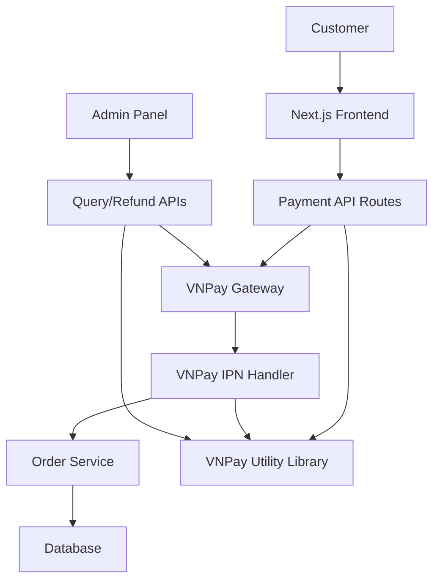

# Design Document

## Overview

This design enhances the existing VNPay integration by implementing a complete payment gateway system based on the official vnpay_nodejs reference implementation. The system will provide secure payment processing, automatic status updates via IPN, transaction querying, and refund capabilities, all integrated with the existing Next.js application architecture.

## Architecture

### High-Level Architecture



### Component Interaction Flow

1. **Payment Creation Flow:**
   - Customer initiates payment → Frontend calls `/api/vnpay/create-payment`
   - API generates secure payment URL → Redirects to VNPay
   - VNPay processes payment → Returns to `/api/vnpay/return`

2. **IPN Processing Flow:**
   - VNPay sends IPN → `/api/vnpay/ipn` validates signature
   - Updates order status → Logs transaction details

3. **Administrative Operations:**
   - Query transaction → `/api/vnpay/query` calls VNPay API
   - Process refund → `/api/vnpay/refund` calls VNPay API

## Components and Interfaces

### 1. Enhanced VNPay Utility Library (`lib/vnpay.ts`)

**Purpose:** Centralized VNPay operations with complete feature set

**Key Functions:**
- `createVNPayPaymentUrl()` - Generate payment URLs
- `verifyVNPaySignature()` - Verify return/IPN signatures  
- `createQueryRequest()` - Generate transaction query requests
- `createRefundRequest()` - Generate refund requests
- `sortObject()` - Parameter sorting for signature generation
- `generateSignature()` - HMAC-SHA512 signature generation

**Enhanced Interface:**
```typescript
interface VNPayConfig {
  tmnCode: string;
  hashSecret: string;
  url: string;
  apiUrl: string;
  returnUrl: string;
}

interface VNPayQueryParams {
  orderId: string;
  transactionDate: string;
  ipAddress: string;
}

interface VNPayRefundParams {
  orderId: string;
  transactionDate: string;
  amount: number;
  transactionType: '02' | '03'; // full or partial
  createBy: string;
  ipAddress: string;
}
```

### 2. Payment Creation API (`/api/vnpay/create-payment`)

**Purpose:** Create VNPay payment URLs with enhanced validation

**Enhancements:**
- Improved order ID generation using moment.js format (DDHHmmss)
- Better IP address detection
- Enhanced error handling and logging
- Support for all VNPay parameters

**Request/Response:**
```typescript
// Request
interface CreatePaymentRequest {
  amount: number;
  orderId?: string;
  orderInfo?: string;
  language?: string;
  bankCode?: string;
}

// Response
interface CreatePaymentResponse {
  success: boolean;
  paymentUrl: string;
  orderId: string;
}
```

### 3. Enhanced Return Handler (`/api/vnpay/return`)

**Purpose:** Process VNPay return callbacks with improved validation

**Enhancements:**
- Comprehensive signature verification
- Better error handling for invalid signatures
- Enhanced logging for debugging
- Proper redirect handling to result pages

### 4. Enhanced IPN Handler (`/api/vnpay/ipn`)

**Purpose:** Process VNPay IPN notifications with database integration

**Enhancements:**
- Complete signature verification matching vnpay_nodejs
- Integration with order service for status updates
- Comprehensive error response codes
- Audit logging for all IPN events

**Response Codes:**
- `00`: Success
- `01`: Order not found
- `02`: Order already processed
- `04`: Amount invalid
- `97`: Signature verification failed
- `99`: Unknown error

### 5. Transaction Query API (`/api/vnpay/query`)

**Purpose:** Query transaction status from VNPay

**New Implementation:**
- POST endpoint accepting orderId and transactionDate
- Proper signature generation using pipe-separated format
- Integration with VNPay merchant API
- Response parsing and error handling

**Request/Response:**
```typescript
// Request
interface QueryRequest {
  orderId: string;
  transactionDate: string; // yyyyMMddHHmmss format
}

// Response
interface QueryResponse {
  success: boolean;
  data?: VNPayQueryResult;
  error?: string;
}
```

### 6. Refund Processing API (`/api/vnpay/refund`)

**Purpose:** Process refunds through VNPay

**New Implementation:**
- POST endpoint for refund requests
- Support for full and partial refunds
- Proper signature generation
- Integration with VNPay merchant API

**Request/Response:**
```typescript
// Request
interface RefundRequest {
  orderId: string;
  transactionDate: string;
  amount: number;
  transactionType: '02' | '03';
  createBy: string;
}

// Response
interface RefundResponse {
  success: boolean;
  data?: VNPayRefundResult;
  error?: string;
}
```

### 7. Enhanced Order Service Integration

**Purpose:** Integrate VNPay operations with order management

**Enhancements:**
- Update order status based on payment results
- Store VNPay transaction references
- Maintain payment history
- Handle payment state transitions

**New Methods:**
```typescript
interface OrderService {
  updatePaymentStatus(orderId: string, status: PaymentStatus, transactionId?: string): Promise<void>;
  getOrderByVNPayRef(vnpayRef: string): Promise<Order | null>;
  logPaymentEvent(orderId: string, event: PaymentEvent): Promise<void>;
}
```

## Data Models

### Enhanced Payment Models

```typescript
interface VNPayTransaction {
  id: string;
  orderId: string;
  vnpayTxnRef: string;
  amount: number;
  responseCode: string;
  transactionNo?: string;
  bankCode?: string;
  payDate?: string;
  status: 'pending' | 'success' | 'failed';
  createdAt: Date;
  updatedAt: Date;
}

interface PaymentEvent {
  type: 'payment_created' | 'payment_returned' | 'ipn_received' | 'query_executed' | 'refund_processed';
  orderId: string;
  vnpayData: Record<string, any>;
  timestamp: Date;
  ipAddress?: string;
}
```

### Order Status Enhancement

```typescript
enum PaymentStatus {
  PENDING = 'pending',
  PROCESSING = 'processing', 
  PAID = 'paid',
  FAILED = 'failed',
  REFUNDED = 'refunded',
  PARTIALLY_REFUNDED = 'partially_refunded'
}
```

## Error Handling

### Comprehensive Error Management

1. **Configuration Errors:**
   - Missing environment variables
   - Invalid VNPay credentials
   - Network connectivity issues

2. **Validation Errors:**
   - Invalid request parameters
   - Signature verification failures
   - Amount mismatches

3. **Business Logic Errors:**
   - Order not found
   - Duplicate payment processing
   - Invalid refund requests

4. **External Service Errors:**
   - VNPay API failures
   - Network timeouts
   - Invalid responses

### Error Response Format

```typescript
interface ErrorResponse {
  error: string;
  code?: string;
  message: string;
  details?: any;
  timestamp: string;
}
```

## Testing Strategy

### Unit Testing

1. **VNPay Utility Functions:**
   - Signature generation and verification
   - Parameter sorting and encoding
   - URL generation

2. **API Endpoints:**
   - Request validation
   - Response formatting
   - Error handling

3. **Order Service Integration:**
   - Status update logic
   - Transaction logging
   - Data persistence

### Integration Testing

1. **VNPay Gateway Integration:**
   - Payment URL generation
   - Return callback processing
   - IPN handling

2. **Database Integration:**
   - Order status updates
   - Transaction logging
   - Data consistency

### End-to-End Testing

1. **Payment Flow:**
   - Complete payment process
   - Success and failure scenarios
   - Return and IPN handling

2. **Administrative Operations:**
   - Transaction queries
   - Refund processing
   - Error scenarios

## Security Considerations

### Data Protection

1. **Sensitive Data Handling:**
   - Environment variable configuration
   - Secure signature generation
   - Request/response logging without sensitive data

2. **Signature Verification:**
   - HMAC-SHA512 implementation
   - Parameter sorting consistency
   - Replay attack prevention

3. **Input Validation:**
   - Request parameter sanitization
   - SQL injection prevention
   - XSS protection

### Compliance

1. **PCI DSS Considerations:**
   - No card data storage
   - Secure transmission
   - Access logging

2. **Vietnamese Regulations:**
   - Local payment method compliance
   - Transaction reporting
   - Data residency requirements

## Performance Considerations

### Optimization Strategies

1. **Caching:**
   - Configuration caching
   - Response caching where appropriate
   - Database query optimization

2. **Async Processing:**
   - Non-blocking IPN processing
   - Background status updates
   - Queue-based refund processing

3. **Monitoring:**
   - Payment success rates
   - Response time tracking
   - Error rate monitoring

## Deployment and Configuration

### Environment Variables

```bash
# VNPay Configuration
VNPAY_TMN_CODE=your_tmn_code
VNPAY_HASH_SECRET=your_hash_secret
VNPAY_URL=https://sandbox.vnpayment.vn/paymentv2/vpcpay.html
VNPAY_API_URL=https://sandbox.vnpayment.vn/merchant_webapi/api/transaction

# Production URLs (when ready)
# VNPAY_URL=https://vnpayment.vn/paymentv2/vpcpay.html  
# VNPAY_API_URL=https://vnpayment.vn/merchant_webapi/api/transaction
```

### Database Migrations

1. **VNPay Transactions Table:**
   - Transaction logging
   - Status tracking
   - Audit trail

2. **Order Enhancements:**
   - Payment status fields
   - VNPay reference fields
   - Transaction history

This design provides a comprehensive, production-ready VNPay integration that matches the functionality of the vnpay_nodejs reference implementation while leveraging Next.js best practices and modern TypeScript patterns.